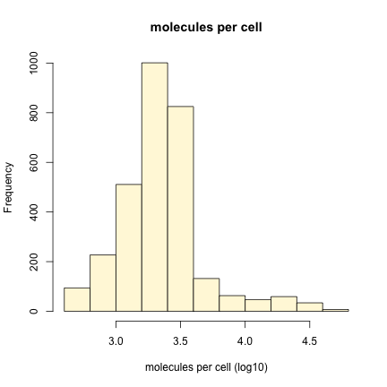
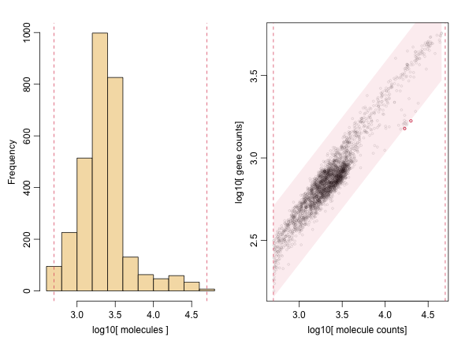
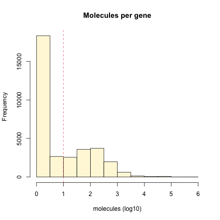
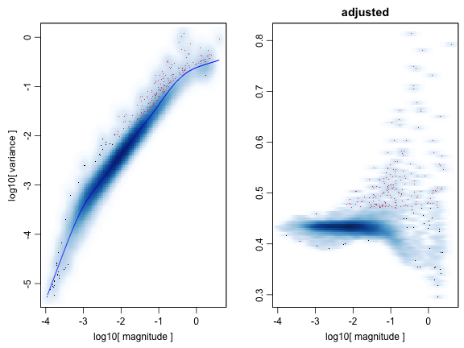
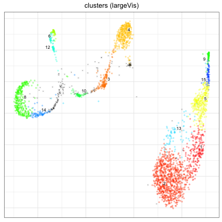
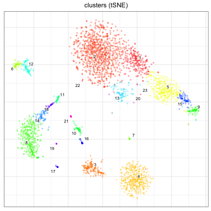
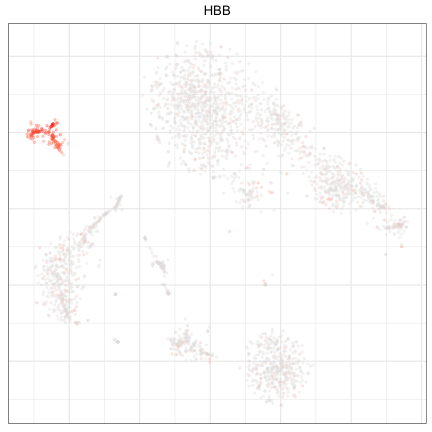
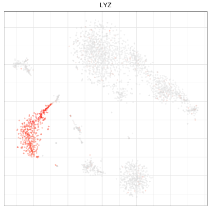
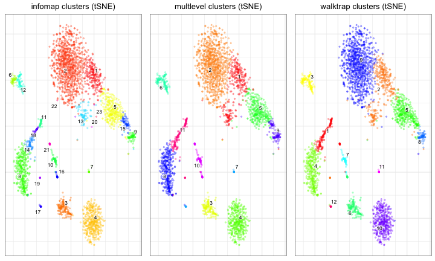
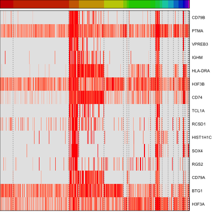

# Pagoda2 Walkthrough

## Overview

This walkthrough will guide you through the analysis of single-cell RNA-seq with pagoda2.

Pagoda2 performs basic tasks such as cell size normalization/corrections and residual gene variance normalization, and can then be used to perform tasks such as identifying subpopulations and running differential expression within individual samples. The companion web application allows users to interactively explore the transcriptional signatures of subpopulations within the dataset. Users are able to investigate the molecular identity of selected entities, and inspect the associated gene expression patterns through annotated gene sets and pathways, including Gene Ontology (GO) categories. Users may also perform differential expression of selected cells via the frontend application.

We will begin by showing the quickest way to process data with pagoda2, using the function `basicP2proc()`. We will then systematically re-run this analysis step-by-step, beginning with loading the dataset and performing QC. This will more thoroughly detail and motivate the steps involved in quality control/processing. Finally we will generate an interactive web application in order to explore the dataset.

## I. Fast Processing and Exploration with Pagoda2

This is the rapid walkthrough of pagoda2, showing how the package allows users to quickly process their datasets and load them into an interactive frontend application.

### Preliminary: Loading the libraries


```r
library(Matrix)
library(igraph)
library(pagoda2)
library(dplyr)
library(ggplot2)
```

We have pre-generated a dataset of 3000 bone marrow cells that you can load as a matrix directly using the package `p2data`, which is available through a `drat` repository on GitHub. Note that the size of the 'p2data' package is approximately 6 MB. This package may be installed as follows:


```r
install.packages('p2data', repos='https://kharchenkolab.github.io/drat/', type='source')
```

(Please see the [drat documentation](https://dirk.eddelbuettel.com/code/drat.html) for more comprehensive explanations and vignettes regarding `drat` repositories.)

The following command load the dataset of 3000 bone marrow cells as a sparse matrix:

```r
countMatrix <- p2data::sample_BM1
```

Note that many users will wish to read in their own data from the outputs of the 10x preprocessing pipeline [CellRanger](https://support.10xgenomics.com/single-cell-gene-expression/software/pipelines/latest/output/matrices), i.e. the gzipped tsv files of matrices, features, and barcodes. For this, we have provided the function `read10xMatrix()`. 

Next we feed this input into the function `basicP2proc()`, which performs all basic pagoda2 processing. That is, the function will adjust the variance, calculate PCA reduction, make a KNN graph, identify clusters by [multilevel optimization](https://igraph.org/c/doc/igraph-Community.html#igraph_community_multilevel) (the Louvain algorithm), and generate largeVis and tSNE embeddings.


```r
## load the dataset
countMatrix <- p2data::sample_BM1
## all basic pagoda2 processing with basicP2proc()
p2.processed <- basicP2proc(countMatrix, n.cores=1, min.cells.per.gene=10, 
                    n.odgenes=2e3, get.largevis=FALSE, make.geneknn=FALSE)
```

```
## creating space of type angular done
## adding data ... done
## building index ... done
## querying ... done
```

We can now quickly view the results via the interactive web application. First we run `extendedP2proc()` to calculate pathway overdispersion for a specific organism using GO. We currently support three organisms: 'hs' (Homo Sapiens), 'mm' (Mus Musculus, mouse) or 'dr' (Danio Rerio, zebrafish). (This can take some time to run, so we'll omit it for the vignettes.) Then we create a pagoda2 "web object" to be used for the application. This can be accessed via your web browser with the function `show.app()`. 


```r
## calculate pathway overdispersion for human
## ext.res <- extendedP2proc(p2.processed, organism = 'hs')

## create app object
## p2app <- webP2proc(ext.res$p2, title = 'Quick pagoda2 app', go.env = ext.res$go.env)

## open app in the web browser via R session
## show.app(app=p2app, name='pagoda2 app')
```

And that's it! You will now be able to interact with the processed dataset via the web browser. The more in-depth demo regarding the web application can be found [here](https://www.youtube.com/watch?v=xzpG1ZYE4Og).


## II. In-Depth Processing and Analysis 

We now will re-run and explain each step within `basicP2proc()`, starting from the beginning:


### Preliminary: Loading the libraries

```r
library(Matrix)
library(igraph)
library(pagoda2)
library(dplyr)
library(ggplot2)
```

### Part 1: Loading and QC'ing the dataset

For the purposes of this walkthrough, we have pre-generated a dataset of 3000 bone marrow cells that you can load as a matrix directly. The following command load the data as a sparse matrix and checks its size:

```r
cm <- p2data::sample_BM1
dim(cm)
```

```
## [1] 33694  3000
```

We see that the matrix has 33k rows and 3k columns. Next let's have a look at our matrix to see what is in it. We see that genes are named using common gene names and columns by cell barcode.

```r
cm[1:3, 1:3]
```

```
## 3 x 3 sparse Matrix of class "dgCMatrix"
##              MantonBM1_HiSeq_1-TCTATTGGTCTCTCGT-1
## RP11-34P13.3                                    .
## FAM138A                                         .
## OR4F5                                           .
##              MantonBM1_HiSeq_1-GAATAAGTCACGCATA-1
## RP11-34P13.3                                    .
## FAM138A                                         .
## OR4F5                                           .
##              MantonBM1_HiSeq_1-ACACCGGTCTAACTTC-1
## RP11-34P13.3                                    .
## FAM138A                                         .
## OR4F5                                           .
```

We can get more information about how the matrix is stored by running `str()`. To find out more information about the sparse matrix format, check the documentation of the 'Matrix' package.

```r
str(cm)
```

```
## Formal class 'dgCMatrix' [package "Matrix"] with 6 slots
##   ..@ i       : int [1:2613488] 33 45 72 153 353 406 436 440 457 484 ...
##   ..@ p       : int [1:3001] 0 864 1701 2607 3256 3856 4537 5271 6030 7002 ...
##   ..@ Dim     : int [1:2] 33694 3000
##   ..@ Dimnames:List of 2
##   .. ..$ : chr [1:33694(1d)] "RP11-34P13.3" "FAM138A" "OR4F5" "RP11-34P13.7" ...
##   .. ..$ : chr [1:3000(1d)] "MantonBM1_HiSeq_1-TCTATTGGTCTCTCGT-1" "MantonBM1_HiSeq_1-GAATAAGTCACGCATA-1" "MantonBM1_HiSeq_1-ACACCGGTCTAACTTC-1" "MantonBM1_HiSeq_1-TCATTTGGTACGCTGC-1" ...
##   ..@ x       : num [1:2613488] 1 1 1 9 1 3 1 2 2 20 ...
##   ..@ factors : list()
```

In order to catch outliers, we can begin with a fairly basic procedure of looking at the dependency between the number of molecules measured per cell and the number of genes per cell. Let's plot the distribution of molecules per cell and molecules per gene for this dataset in log10 scale:

```r
old_par <- par(mfrow=c(1,2), mar = c(3.5,3.5,2.0,0.5), mgp = c(2,0.65,0), cex = 1.0)
on.exit(par(old_par))
hist(log10(colSums(cm)+1), main='molecules per cell', col='cornsilk', xlab='molecules per cell (log10)')
```



```r
hist(log10(rowSums(cm)+1), main='molecules per gene', col='cornsilk', xlab='molecules per gene (log10)')
```


This dataset has already been filtered for low quality cells, so we don't see any cells with fewer that 10^3 UMIs. We can still use the default QC function `gene.vs.molecule.cell.filter()` to filter any cells that don't fit the expected detected gene vs molecule count relationship. In this case we filter out only 2 cells.

```r
counts <- gene.vs.molecule.cell.filter(cm, min.cell.size=500)
```



Next thing we want to do is to find lowly expressed genes and remove them from the dataset. (Subsequent pagoda2 steps will do this automatically for extremely lowly expressed genes anyway, but for the purpose of this tutorial, we demonstrate this.)


```r
hist(log10(rowSums(counts)+1), main='Molecules per gene', xlab='molecules (log10)', col='cornsilk')
abline(v=1, lty=2, col=2)
```



Let's filter out counts less than 10 and check the size of the resulting matrix:


```r
counts <- counts[rowSums(counts)>=10, ]
dim(counts)
```

```
## [1] 12693  2998
```


### Part 2: Analysing Data with Pagoda2

We see that we now have 12k genes and 2998 cells. We are now ready to analyze our data with Pagoda2. Remember: all of the following steps can be done with just two functions automatically (see above) but for the purposes of this tutorial we will go over them step by step to understand what we are doing in more detail. Doing these steps manually also allows us to tune parameters.

First we will generate a pagoda2 object that will contain all our results. Our input matrix contains duplicated gene names (usually originating from different transcripts in the counting process). The easier way to resolve this problem is by making the gene names unique:


```r
rownames(counts) <- make.unique(rownames(counts))
r <- Pagoda2$new(counts, log.scale=TRUE, n.cores=1)
```

```
## 2998 cells, 12693 genes; normalizing ...
```

```
## Using plain model
```

```
## log scale ...
```

```
## done.
```

Check that you have the matrix in the correct orientation and that number of cells you are getting here is what you expect (like we do here). The input matrix must be in the genes by cells configuration.

Next, we’ll adjust the variance with `adjustVariance()` in order to normalize the extent to which genes with (very) different expression magnitudes will contribute to the downstream analysis. 

In order to motivate what we are doing by variance normalization, recall that our goal is to measure the variance of a given gene. (Remember: we are looking
at the variation of this gene across the population of cells measured.)
The key dependency of this variance is the magnitude. If you thus observe highly-expressed genes, these will always give you high expression variance, 
regardless of whether these are specific to a cell subpopulation or not. 

For variance normalization, we begin by fitting a smooth linear model of variance by magnitude for the dataset. We then quantify the deviation against this dataset-wide trend, and rescale the variance to put the genes on a comparable scale for downstream analysis.


```r
r$adjustVariance(plot=TRUE, gam.k=10)
```

```
## calculating variance fit ...
```

```
##  using gam
```

```
## 187 overdispersed genes ... 187
```

```
## persisting ...
```

```
##  using gam
```

```
## done.
```



Now that the variance of the gene expression is on a comparable scale, there are many alternative ways of proceeding with the downstream analysis. Below we’ll use the simplest default scenario, whereby we first reduce the dataset dimensions by running PCA, and then move into the k-nearest neighbor (KNN) graph space for clustering and visualization calculations. 

First, we generate the PCA reduction. Depending on the complexity of the dataset you are analyzing, you may want to adjust the parameter `nPcs`.


```r
r$calculatePcaReduction(nPcs=50, n.odgenes=3e3)
```

```
## running PCA using 3000 OD genes .
```

```
## .
## .
## .
```

```
##  done
```

We will now construct a KNN graph space that will allow us to identify clusters of cells:

```r
r$makeKnnGraph(k=40, type='PCA', center=TRUE, distance='cosine')
```

```
## creating space of type angular done
## adding data ... done
## building index ... done
## querying ... done
```

On the basis of this KNN graph, we will call clusters

```r
r$getKnnClusters(method=infomap.community, type='PCA')
```

Next we generate a 2D embedding of the data with largeVis for visualization:

```r
M <- 30
r$getEmbedding(type='PCA', embeddingType = 'largeVis', M=M, perplexity=30, gamma=1/M)
```

```
## Estimating embeddings.
```
(Note that largeVis is much faster that the tSNE, which often used in single-cell analysis.)

We now visualize the data:


```r
r$plotEmbedding(type='PCA', show.legend=FALSE, mark.groups=TRUE, min.cluster.size=50, shuffle.colors=FALSE, font.size=3, alpha=0.3, title='clusters (largeVis)', plot.theme=theme_bw() + theme(plot.title = element_text(hjust = 0.5)))
```



We next can construct and plot a tSNE embedding. (This can take some time to complete.)

```r
r$getEmbedding(type='PCA', embeddingType='tSNE', perplexity=50,verbose=FALSE)
r$plotEmbedding(type='PCA', embeddingType='tSNE', show.legend=FALSE, mark.groups=TRUE, min.cluster.size=1, shuffle.colors=FALSE, font.size=3, alpha=0.3, title='clusters (tSNE)', plot.theme=theme_bw() + theme(plot.title = element_text(hjust = 0.5)))
```



Note that we are overlay the expresssion of specific marker genes on this embedding to identify clusters. For instance, subsetting by `"HBB"` will identify heme cells:


```r
gene <-"HBB"
r$plotEmbedding(type='PCA', embeddingType='tSNE', colors=r$counts[,gene], shuffle.colors=FALSE, 
    font.size=3, alpha=0.3, title=gene, plot.theme=theme_bw() + theme(plot.title = element_text(hjust = 0.5)))
```



Similarly, subsetting by the marker gene `"LYZ"` should show us CD14+ Monocytes:


```r
gene <-"LYZ"
r$plotEmbedding(type='PCA', embeddingType='tSNE', colors=r$counts[,gene], shuffle.colors=FALSE, 
    font.size=3, alpha=0.3, title=gene, plot.theme=theme_bw() + theme(plot.title = element_text(hjust = 0.5)))
```



Pagoda2 allows us to generate multiple alternative clusterings. Here we will construct multilevel and walktrap clusterings (along with the infomap clusterings generated above):

```r
r$getKnnClusters(method=multilevel.community, type='PCA', name='multilevel')
r$getKnnClusters(method=walktrap.community, type='PCA', name='walktrap')
```

Internally the clusters are saved in the clusters variable under the reduction from which they were obtained:


```r
str(r$clusters)
```

```
## List of 1
##  $ PCA:List of 3
##   ..$ community : Factor w/ 21 levels "1","2","3","4",..: 5 1 1 6 6 1 2 4 2 13 ...
##   .. ..- attr(*, "names")= chr [1:2998] "MantonBM1_HiSeq_1-TCTATTGGTCTCTCGT-1" "MantonBM1_HiSeq_1-GAATAAGTCACGCATA-1" "MantonBM1_HiSeq_1-ACACCGGTCTAACTTC-1" "MantonBM1_HiSeq_1-TCATTTGGTACGCTGC-1" ...
##   ..$ multilevel: Factor w/ 11 levels "1","2","3","4",..: 4 8 8 11 11 8 5 2 5 7 ...
##   .. ..- attr(*, "names")= chr [1:2998] "MantonBM1_HiSeq_1-TCTATTGGTCTCTCGT-1" "MantonBM1_HiSeq_1-GAATAAGTCACGCATA-1" "MantonBM1_HiSeq_1-ACACCGGTCTAACTTC-1" "MantonBM1_HiSeq_1-TCATTTGGTACGCTGC-1" ...
##   ..$ walktrap  : Factor w/ 11 levels "1","2","3","4",..: 5 8 8 6 6 8 9 4 9 3 ...
##   .. ..- attr(*, "names")= chr [1:2998] "MantonBM1_HiSeq_1-TCTATTGGTCTCTCGT-1" "MantonBM1_HiSeq_1-GAATAAGTCACGCATA-1" "MantonBM1_HiSeq_1-ACACCGGTCTAACTTC-1" "MantonBM1_HiSeq_1-TCATTTGGTACGCTGC-1" ...
```

We can now compare these against `infomap.community`. 

#### Infomap.community vs. multilevel.community vs. walktrap.community


```r
plt1 = r$plotEmbedding(type='PCA', embeddingType='tSNE', groups=r$clusters$PCA$community, show.legend=FALSE, mark.groups=TRUE, min.cluster.size=1, shuffle.colors=FALSE, font.size=3, alpha=0.3, title='infomap clusters (tSNE)', plot.theme=theme_bw() + theme(plot.title = element_text(hjust = 0.5)))
plt2 = r$plotEmbedding(type='PCA',embeddingType='tSNE', clusterType='multilevel', show.legend=FALSE, mark.groups=TRUE, min.cluster.size=1, shuffle.colors=FALSE, font.size=3, alpha=0.3, title='multlevel clusters (tSNE)', plot.theme=theme_bw() + theme(plot.title = element_text(hjust = 0.5)))
plt3 = r$plotEmbedding(type='PCA',embeddingType='tSNE', clusterType='walktrap', show.legend=FALSE, mark.groups=TRUE, min.cluster.size=1, shuffle.colors=FALSE, font.size=3, alpha=0.3, title='walktrap clusters (tSNE)', plot.theme=theme_bw() + theme(plot.title = element_text(hjust = 0.5)))
gridExtra::grid.arrange(plt1, plt2, plt3, ncol=3)
```



We can then perform differential expression between these clusters:


```r
r$getDifferentialGenes(type='PCA', verbose=TRUE, clusterType='community')
```

```
## running differential expression with 21 clusters ...
```

```
## adjusting p-values ...
```

```
## done.
```


and visualise the top markers of a specific cluster:


```r
de <- r$diffgenes$PCA[[1]][['2']]
r$plotGeneHeatmap(genes=rownames(de)[1:15], groups=r$clusters$PCA[[1]])
```



Let's further investigate the marker gene `"CD74"` as shown above, with `plotEmbedding()`:


```r
gene <-"CD74"
r$plotEmbedding(type='PCA', embeddingType='tSNE', colors=r$counts[,gene], shuffle.colors=FALSE, 
    font.size=3, alpha=0.3, title=gene, legend.title=gene)
```


At this point we can perform pathway overdispersion analysis (in the same way we would with pagoda1 in [scde](https://hms-dbmi.github.io/scde/)) or investigate hierarchical differential expression. The following two code snippets will run overdispersion analysis (although we don't run the second in this tutorial, as it takes too long to complete). Overdispersion analysis usually takes too long with the latest datasets composed of +1000's of cells---for this reason we prefer hierarchical differential expression. 

We will need the output of the first of the following two blocks for our web app generation:

```r
suppressMessages(library(org.Hs.eg.db))
# translate gene names to ids
ids <- unlist(lapply(mget(colnames(r$counts), org.Hs.egALIAS2EG, ifnotfound=NA), function(x) x[1]))
# reverse map
rids <- names(ids)
names(rids) <- ids
# list all the ids per GO category
go.env <- list2env(eapply(org.Hs.egGO2ALLEGS,function(x) as.character(na.omit(rids[x]))))
```


```r
## DON'T RUN
## test overdispersion
# r$testPathwayOverdispersion(go.env, verbose=TRUE, correlation.distance.threshold=0.95, recalculate.pca=FALSE, top.aspects=15)
```


Run hierarchical differential expression. This examines cells down a hierarchy of clusters and determines differentially expressed genes at every split.

```r
hdea <- r$getHierarchicalDiffExpressionAspects(type='PCA', clusterName='community', z.threshold=3)
```

```
## Using community clustering for PCA space
```

Finally, please do not forget to save your pagoda2 object as an rds object:

```r
##  saveRDS(r, 'pagoda2object.rds')
```

This is very important for future reproducibility, as well as any collaborations you may have.

### Part 3: Generate Frontend Application

Next we will generate a web app that will allow us to browse the dataset interactively. (Note that all these steps can be performed with the `basicP2web()` function, as described above in the first section.)

We will need to prepare a set of genes that we want to be accessible from the application. For the hierarchical differential expression to work, we must include the geneset used from the hierarchical differential expression. However we can include any genesets we want, including GO geneset and custom sets of marker genes:

```r
genesets <- hierDiffToGenesets(hdea)
str(genesets[1:2])
```

```
## List of 2
##  $ 14.vs.15:List of 2
##   ..$ properties:List of 3
##   .. ..$ locked          : logi TRUE
##   .. ..$ genesetname     : chr "14.vs.15"
##   .. ..$ shortdescription: chr "14.vs.15"
##   ..$ genes     : chr [1:160] "PRTN3" "ELANE" "MPO" "AZU1" ...
##  $ 10.vs.3 :List of 2
##   ..$ properties:List of 3
##   .. ..$ locked          : logi TRUE
##   .. ..$ genesetname     : chr "10.vs.3"
##   .. ..$ shortdescription: chr "10.vs.3"
##   ..$ genes     : chr [1:109] "H2AFZ" "HMGB1" "PTMA" "LYZ" ...
```

To add GO Terms as genesets, run the following

```r
library(GO.db)
```

```
## 
```

```r
termDescriptions <- Term(GOTERM[names(go.env)]) # saves a good minute or so compared to individual lookups

sn <- function(x) { names(x) <- x; x}  ## utility function

genesets.go <- lapply(sn(names(go.env)),function(x) {
  list(properties=list(locked=TRUE, genesetname=x, shortdescription=as.character(termDescriptions[x])), genes=c(go.env[[x]]))
})

## concatenate
genesets <- c(genesets, genesets.go)
```

Add per cluster differentially expressed genes to the gene sets:

```r
deSets <- get.de.geneset(r, groups = r$clusters$PCA[['community']], prefix = 'de_')
## concatenate
genesets <- c(genesets, deSets)
```

Next we can add metadata to our web app. The metadata we add can be completely arbitrary and include processing parameters, notes of anything else we like. They are provided in a list of strings. If we include an entry called apptitle, this will appear as an app title in our web browser when we open the app.

```r
appmetadata <- list(apptitle = 'Demo_App')
```

We also want to update the original pagoda2 object to contain a KNN graph of genes. We will need this to enable the 'find similar gene' feature of our application. This takes a moment to complete.

```r
r$makeGeneKnnGraph(n.cores = 1)
```

```
## creating space of type angular done
## adding data ... done
## building index ... done
## querying ... done
```

Finally before we make our web app we want to generate metadata for the cells. The exact data that we will want to incorporate will depend on the dataset we are processing. For example if we are co-processing multiple samples we will usually want to label cells by the sample of origin. We might also want to add our clusterings as metadata. 

Several functions give very detailed control over how metadata will be presented and generated. For example we can generate different palettes or set colors manually. The factorListToMetadata() function will do everything for us, check its documentation for more details. Here we will generate metadata for the different clusterings we previously generated manually:


```r
## # Make a list for our metadata
additionalMetadata <- list()
## for Infomap use hue values from 0.1 to 0.5
additionalMetadata$community <- p2.metadata.from.factor(r$clusters$PCA[['community']], displayname = 'Infomap', s = 0.7, v = 0.8,start = 0.1, end = 0.5)
# use different colors for multilevel
additionalMetadata$multilevel <- p2.metadata.from.factor(r$clusters$PCA[['multilevel']], displayname = 'Multilevel', s = 0.9, v = 0.8,start = 0.5, end = 1)
## Manual palette generation for walktrap
a <- r$clusters$PCA[['walktrap']]
library(colorRamps)
p1 <- colorRamps::primary.colors(n = nlevels(a))
names(p1) <- levels(a)
additionalMetadata$walktrap <- p2.metadata.from.factor(r$clusters$PCA[['walktrap']], displayname = 'Walktrap', pal = p1)
```

We are now ready to build our app:

```r
p2web <- make.p2.app(r, 
    dendrogramCellGroups = r$clusters$PCA$community,
    additionalMetadata = additionalMetadata,
    geneSets = genesets,
    appmetadata = appmetadata,
    show.clusters = FALSE # Hide the clusters that were used for the dendrogram from the metadata
  )
```

We can view this app directly from our R session, which will open the application in the browser:


```r
##  show.app(app=p2web, name='app')
```

This app will now be viewable as long as our R session is running. However we also have the option to serialize this app into a binary file `*.bin` on our hard drive that will allow us to view it after we close the R session directly from our browser:


```r
##  p2web$serializeToStaticFast('demo_pbmc.bin', verbose=TRUE)
```

### View Conos Object in Pagoda2 Frontend Application

Users may also interactively explore [Conos](https://github.com/kharchenkolab/conos) objects with the Pagoda2 application.

After constructing the Conos object `con` as shown in the Conos [walkthrough](https://github.com/kharchenkolab/conos/blob/master/doc/walkthrough.md), users can save to a serialized `*.bin` file and upload into the pagoda application with the `p2app4conos()` function, using `p2app4conos(conos=con)`. Please see Conos for more details.

### More Details

For the more in-depth demo regarding how to use the web application to analyze datasets, please check [here](https://www.youtube.com/watch?v=xzpG1ZYE4Og).

You can view the offline app by pointing your browser to http://pklab.med.harvard.edu/nikolas/pagoda2/frontend/current/pagodaLocal/index.html

The file can also be shared by uploading it to a web server and be viewed remotely by navigating to the following URL: http://pklab.med.harvard.edu/nikolas/pagoda2/frontend/current/pagodaURL/index.html?fileURL= [URL TO FILE]

